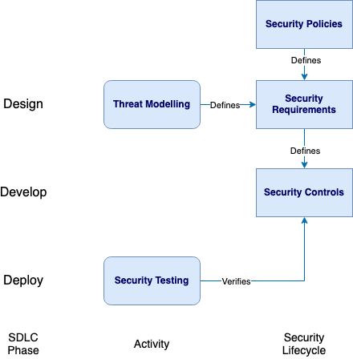
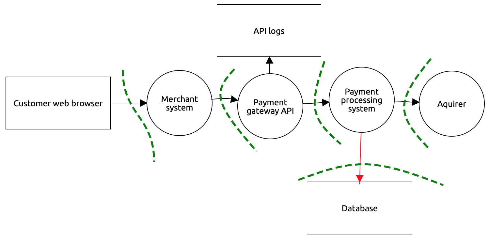

# Threat modelling

Use threat modelling to identify potential security issues early in the
development lifecycle. Identifying issues early results in a reduction
of vulnerabilities in a deployed system. This section will discuss why
it is useful for developers to do threat modelling, give a step by step
guide of the threat modelling activity, and how to introduce the
activity to development teams by using gamification.

The goal of the threat modelling activity is to create the security
requirements for a system. When building the system, the security
requirements are incorporated, with appropriate security controls
addressing identified areas of vulnerability. Security testing is later
used to ensure the security controls are in place, verifying that the
security requirements have been met. This gives assurance that the
system is secure.

{width=70%}\
*Figure 6-1: Security Requirements Flow Diagram*

## Why should developers perform threat modelling?

Security architects review solution designs and find security flaws.
However, there is often a limited number of security architects and
security professionals available to provide guidance, creating a
bottleneck at the design phase. By introducing threat modelling into the
development team, it can help to eliminate this bottleneck and scale out
security.

When introducing the threat modelling activity, take into consideration
the development teams workflow and current tools used. Consider using
tools already in use rather than introducing a new tool which may take
time to learn, in addition to learning threat modelling.

Threat modelling can be introduced to the development team by a security
team member or other team member knowledgeable in security, who is able
to convey possible attack patterns and appropriate security controls. It
can be helpful for this person to be present in the initial threat
modelling activities to provide guidance, before the development team
manages the activity themselves.

To introduce threat modelling to the development team, use a system that
the team is familiar with.

## Terminology

Terminology used as part of threat modelling and risk management:

-   **Vulnerability**: a weakness in the software or missing security
    control
-   **Threat agent**: an attacker who exploits a vulnerability
-   **Risk severity**: the risk posed to the organisation by a
    particular vulnerability. Risk severity is calculated from the
    Impact and Likelihood values.
-   **Impact**: the business impact resulting from a threat
-   **Likelihood**: the likelihood of the threat occurring
-   **Security Controls**: reduce Likelihood or Impact of a threat by
    addressing the associated vulnerability

For example, the threat of a Cross-Site Scripting attack (in which the
*threat agent* causes unauthorised javascript to run in the victim's web
browser) attempts to exploit a *vulnerability* in the lack of input
validation and use of escaping functions in a web application. An
appropriate *security control* is to use input validation and escaping
libraries, and a Web Application Firewall (WAF).

## A simplified step-by-step guide of the threat modelling process

### 1. Model the system

Draw a data flow diagram of the system. There are particular tools
available that can be used in threat modelling to create a data flow
diagram and indicate the threats, such as [OWASP Threat
Dragon](https://owasp.org/www-project-threat-dragon/). Also consider
making use of any existing tools the development team is already
familiar with, rather than introducing a new tool, which may take time
to learn and adopt.

#### Example: threat model of a payment gateway

A data flow diagram created in OWASP Threat Dragon showing the flow from
a web browser using a merchant system to make a payment. The merchant
system accesses a payment gateway, which uses a payment processing
system, storing transaction details in a database.

\
*Figure 6-2: Example Threat Model*

Threat model data flow diagrams use a rectangle to represent Actors. A
circle is used to represent Processes, such as a web application or API.
And a rectangle without vertical edges is used to represent data stores,
such as a database or configuration files. Arrows are used to indicate
the information flows between the Actors, Processes and data stores.
Trust boundaries, dotted lines, are placed on the data flow diagram on
information flows between systems to indicate where data changes its
level of trust. Finally, identify any sensitive data that exists, either
in information flows or data stores. It may help to consult the
organisation\'s data classification policy when identifying the
sensitive data.

### 2. Identify threat agents/vulnerabilities

-   Define attack entry points (trust boundaries)

-   Look for system vulnerabilities and threats for identified attack
    entry points (threats can be external threat agents or inside threat
    agents).

-   To help identify possible threats and vulnerabilities, the
    [STRIDE methodology](https://owasp.org/www-community/Threat_Modeling_Process#stride)
    can be used. If a development team is not yet familiar with the
    STRIDE methodology, it may be easiest to instead use a list of
    threats that the team is familiar with. A custom or standard
    checklist can be used focusing on either:

    -   Vulnerabilities, such as [OWASP Top Ten](https://owasp.org/www-project-top-ten/)

    -   Security requirements, such as [OWASP Application Security Verification Standard (ASVS)](https://owasp.org/www-project-application-security-verification-standard/)

    -   Attacks, such as [OWASP Attacks list](https://owasp.org/www-community/attacks/)

#### Example: threat model of a payment gateway

-   Define attack entry point: communication to the database
-   Define vulnerability: sensitive data exposure (OWASP Top Ten
    A3:2017)
-   Associated security requirement: encrypted communications required
    (OWASP ASVS v4.0.2-9.2.2)

### 3. Determine risk ratings

-   Define impact and likelihood of each threat. This can be either a
    quantitative measure, such as [OWASP Risk Rating
    Methodology](https://owasp.org/www-community/OWASP_Risk_Rating_Methodology),
    or qualitative using for example low; medium; high ratings.
-   Determine risk rating for each threat (calculated from impact and
    likelihood)
-   Rank threats by severity rating

#### Example: threat model of a payment gateway

-   Risk rating for missing encrypted communication to the database is
    determined to be Low

### 4. Determine mitigations

-   Determine risk treatment strategy for each risk: reduce, transfer,
    avoid, accept
-   Agree on risk mitigation with risk owner and stakeholders
-   Select appropriate controls according to strategy. Consider using
    the [OWASP Top Ten Proactive
    Controls](https://owasp.org/www-project-proactive-controls/)
-   Write security tests to test the controls are in place
-   Reevaluate risk rating after controls applied
-   Periodically retest risk

#### Example: threat model of a payment gateway

-   Risk mitigation selected is to encrypt the communication to the
    database (OWASP Proactive Control C3)

For further guidance on threat modelling consult the following
resources:

-   [OWASP Threat Modeling community
    page](https://owasp.org/www-community/Threat_Modeling)
-   [OWASP Threat Modeling Cheat
    Sheet](https://cheatsheetseries.owasp.org/cheatsheets/Threat_Modeling_Cheat_Sheet.html)

## Gamification

Use gamification as a way to introduce the threat modelling activity to
the development team. Gamification can ensure all members of a team are
involved and given the opportunity to provide input. A security team
member can initially run and record the results of the gamification
activity, before handing over to the development team.

The [OWASP Cornucopia](https://owasp.org/www-project-cornucopia) card game is
designed to help developers think about possible threats in a solution
design, and derive a set of security requirements to build against. Team
members are each dealt cards which describe particular threats. They
then take turns trying to make a case for their particular threat posing
a risk to the solution design, scoring points if they are able to do so.

OWASP Cornucopia uses threats grouped into areas that are particularly
relevant to software developers, such as authentication; authorisation;
data validation. The threats are derived from [OWASP Application
Security Verification Standard
(ASVS)](https://owasp.org/www-project-application-security-verification-standard/)
and [OWASP Web Security Testing
Guide](https://owasp.org/www-project-web-security-testing-guide/).
Using OWASP Cornucopia can be useful when it is desired to have security
requirements aligned with these standards.